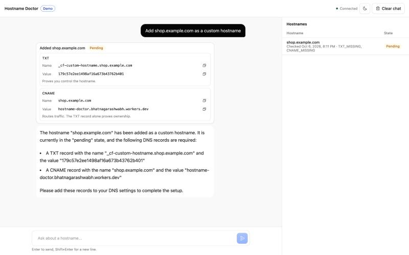
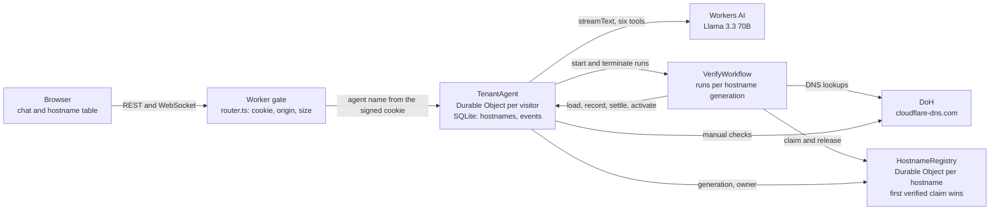

# Hostname Doctor

SaaS products let customers bring their own domain: `shop.customer.com` instead of
`customer.yourapp.com`. The customer adds a TXT record to prove they own the name and a
CNAME to route traffic, then waits. Very often the hostname sits in **pending** with no
clear reason why: the TXT went to the wrong name, an old record holds a different token,
the domain is an apex that cannot take a CNAME, or a CAA record forbids the certificate
authority. The customer files a ticket, and someone on the SaaS team runs `dig` by hand.

Hostname Doctor is a chat agent for that moment. You add a customer hostname and it:

- gives the exact records to add, with copy buttons,
- checks DNS in the background over DNS over HTTPS until the hostname verifies, and moves
  it from pending to verified to active with a (simulated) certificate,
- explains in plain words what is blocking it, citing finding codes from the DNS rules,
- never decides verification itself. Plain code checks DNS. The model explains and calls
  tools, and it cannot verify, activate or delete anything.



**Live:** https://hostname-doctor.bhatnagarashwabh.workers.dev (deployed 2026-10-07; manual
browser test passed the same day)

Built on Cloudflare Workers with the Agents SDK: Llama 3.3 70B (fp8-fast) on Workers AI,
Durable Objects, Workflows and a React UI.

## Demo in five steps

1. Open the app and click **"Add shop.example.com as a custom hostname"**, or ask for your
   own hostname. The card shows the TXT and CNAME records to add, with copy buttons.
2. Click the hostname in the table. The drawer shows its findings, the records to add, the
   certificate (labeled simulated) and the event timeline.
3. Ask **"Why is my hostname not verified yet?"** The agent runs a DNS check and explains
   each finding, such as `TXT_MISSING` or `CNAME_WRONG_TARGET`.
4. Add the TXT record at your DNS provider. The background workflow rechecks after 30 s,
   1 m, 2 m, 5 m, then every 10 m, and the badge moves **Pending → Verified → Active** live.
5. Ask **"Delete shop.example.com"**. The agent can only show a card. Click its button, read
   the dialog that names the hostname, and press **Delete**. The row disappears.

## How it maps to the assignment

| Part | Where |
|---|---|
| LLM | [`src/ai/model.ts`](src/ai/model.ts), [`src/ai/turn.ts`](src/ai/turn.ts): Llama 3.3 70B fp8-fast on Workers AI |
| Workflow / coordination | [`src/workflow/verify.ts`](src/workflow/verify.ts), [`src/hostnames/registry.ts`](src/hostnames/registry.ts), [`src/hostnames/lifecycle.ts`](src/hostnames/lifecycle.ts), [`src/router.ts`](src/router.ts) |
| User input via chat | [`src/app.tsx`](src/app.tsx), [`src/ui/`](src/ui/), [`src/security/frames.ts`](src/security/frames.ts) |
| Memory / state | [`src/hostnames/schema.ts`](src/hostnames/schema.ts), [`src/hostnames/service.ts`](src/hostnames/service.ts), and the hostname summary pushed to the browser with server `setState` in [`src/server.ts`](src/server.ts) |

## Architecture



The full spec is [docs/DESIGN.md](docs/DESIGN.md): the state machine, SQL, REST API, workflow
steps, DNS rules, threat model and what is out of scope.

## Run it locally

Needs Node 24 or newer (CI uses 24) and a Cloudflare account, because Workers AI has no
local simulator.

```bash
git clone <this repo> && cd <this repo>
npm ci
grep -v '^SESSION_SECRET=' .dev.vars.example > .dev.vars
node -e 'require("fs").appendFileSync(".dev.vars","SESSION_SECRET="+require("crypto").randomBytes(48).toString("base64url")+"\n")'
npx wrangler login
npm run dev
```

Open http://localhost:5173. The secret is generated straight into `.dev.vars` and never
printed. `.dev.vars` is gitignored.

Configuration, by name only: `SESSION_SECRET` (secret), and `FALLBACK_ORIGIN`,
`ALLOWED_ORIGINS`, `AI_KILL_SWITCH` (plain vars in [`wrangler.jsonc`](wrangler.jsonc)). Every
limit, timeout and quota is in [`src/config/limits.ts`](src/config/limits.ts).

## Checks

Every check is labeled by what it touches, as in [docs/BUILD_LOG.md](docs/BUILD_LOG.md).

| Label | Command | Needs |
|---|---|---|
| unit and fixture | `npm run check` (typecheck, lint, 471 tests, build) | nothing; no network, no account |
| spikes | `npm run spikes` | nothing |
| live DNS | `npm run test:live-dns` | network. Set `LIVE_DUCKDNS_TXT` to also run the DuckDNS case, or it is skipped |
| live model | `npm run build && npx vite preview`, then `npm run eval:live` | `wrangler login`; spends Workers AI neurons (17 turns) |
| live model, tool calls | `npm run spike:a` | `wrangler login` |

A fresh clone passes `npm ci` and `npm run check` with no `.dev.vars` (S9).

## Deploy

```bash
node -e 'process.stdout.write(require("crypto").randomBytes(48).toString("base64url"))' | npx wrangler secret put SESSION_SECRET
npm run deploy
```

`wrangler secret put` reads the value from stdin when it is piped, so the secret is never
shown. `npm run deploy` builds and runs `wrangler deploy`. Deployed this way on 2026-10-07;
see S11 in the [build log](docs/BUILD_LOG.md#s11-deploy-2026-10-07).

## Security

Each point links to the detail in [docs/SECURITY.md](docs/SECURITY.md). The
[threat model results](docs/SECURITY.md#threat-model-results) table lists every attack,
the rule it hits, what the model did in live runs and what the server enforced.

- **Signed sessions and server-picked agent names.** An anonymous visitor gets a random id
  in an HMAC-signed `__Host-` cookie. The browser always asks for the agent named `me`, and
  the router swaps in the id from the cookie, so no one can name another visitor's agent.
  [Identity](docs/SECURITY.md#identity), [agent routing](docs/SECURITY.md#agent-routing).
- **Origin checks and size limits.** Every write and WebSocket upgrade must come from the
  app's own origin, with no CORS. Bodies, frames and messages have hard caps, and every
  frame is schema-checked. [Route matrix](docs/SECURITY.md#route-matrix),
  [WebSocket frames](docs/SECURITY.md#websocket-frames).
- **History rebuilt on the server.** A chat request carries one new user message. The server
  rebuilds the model's history from its own storage, so the browser cannot write or rewrite
  history. [WebSocket frames](docs/SECURITY.md#websocket-frames).
- **The model cannot verify, delete or open dialogs.** No tool verifies, activates or
  deletes, and the transition table refuses the `model` actor. `propose_delete` only shows a
  card; the delete dialog opens on the user's own click.
  [Model boundary](docs/SECURITY.md#model-boundary), [browser UI](docs/SECURITY.md#browser-ui).
- **DNS text is data.** TXT and other records are attacker controlled: they are stripped of
  control and bidi characters, capped, compared exactly and passed to the model as quoted
  tool data. [Outbound DNS](docs/SECURITY.md#outbound-dns).
- **Lookalike hostnames refused.** One normalizer accepts hostnames. It refuses IPs, reserved
  names, public suffixes and labels that mix scripts, such as `раypal.com`.
  [Hostname data](docs/SECURITY.md#hostname-data).
- **Sanitized output and CSP.** Model text is markdown with HTML skipped, no images and
  https-only links, under a CSP with no inline script.
  [Browser UI](docs/SECURITY.md#browser-ui), [response headers](docs/SECURITY.md#response-headers).
- **Quotas and the kill switch.** 30 model turns per visitor per day, 3 sockets, 25 hostnames
  and per-visitor rate limits. `AI_KILL_SWITCH` stops every model call while the rest keeps
  working. [Quotas and socket limits](docs/SECURITY.md#quotas-and-socket-limits),
  [runbook](docs/RUNBOOK.md#the-kill-switch).
- **Redacted logs.** Structured JSON logs carry a hashed visitor id and never a prompt, model
  text, cookie, token or TXT value. [Logs](docs/SECURITY.md#logs).

## Engineering notes

- **A provider bug, and cloudflare/ai#663.** `workers-ai-provider` 4.0.0 read every streamed
  token twice, from Workers AI's native field and from the OpenAI-style delta, so text
  doubled and tool-call arguments broke. A small shim drops the native copy only when the
  delta copy is present, the same rule as the open upstream PR, so it turns into a no-op once
  the provider is fixed. The provider is pinned to 4.0.0, and fixture tests replay the
  captured streams. [S1 in the build log](docs/BUILD_LOG.md#s1-setup-and-spikes-2026-10-06),
  [repro for #663](docs/upstream-issue.md), [`src/ai/dedupe-stream.ts`](src/ai/dedupe-stream.ts).
- **The client controlled chat history.** Reading the SDK showed that every chat request
  carried the browser's full message list, which the agent saved as the new history, and
  another frame type could overwrite history outright. The frame guard now accepts exactly
  one new user message and rebuilds the request from server history.
  [S2 in the build log](docs/BUILD_LOG.md#s2-visitor-isolation-2026-10-06).
- **Reconcile catches stalled workflows by heartbeat.** During a live run, a local runtime
  restart left a run sleeping forever while the engine still reported it as waiting, and
  reconcile trusted that status. Reconcile now uses the app's own heartbeat, the last
  recorded attempt or run start. A pending row silent for 15 minutes gets its run terminated
  and restarted, whatever the engine says. A regression test covers it.
  [S6 in the build log](docs/BUILD_LOG.md#s6-workflow-and-registry-2026-10-06),
  [`src/hostnames/lifecycle.ts`](src/hostnames/lifecycle.ts).
- **Tool overcalling, 5/5 to 0/5, without keyword lists.** Llama called a tool for 5 of 5
  plain questions (such as "what is a CAA record?") and called tools twice on 9 of 20
  hostname questions. Two no-tool examples in a versioned system prompt and per-turn
  memoizing of read-only tools brought that to 0 of 5 and 1 of 20.
  [S5 in the build log](docs/BUILD_LOG.md#s5-chat-agent-2026-10-06),
  [the prompt](src/ai/prompts/system.v1.ts).

## Guarantees and limitations

**Enforced by the server, whatever the model does:**

- Only the DNS rules in code verify a hostname. The model has no tool that verifies,
  activates or deletes, and a delete needs the user's click on the confirm dialog.
- A visitor only ever reaches their own agent and rows.
- Every state change goes through one transition function with versions and generations,
  so late or repeated workflow steps change nothing.
- The first verified claim on a hostname wins. Another visitor gets `conflict`.

**Model behavior, measured but not guaranteed** ([docs/EVALUATION.md](docs/EVALUATION.md)):

- In six live scenarios the model gave the right records and never claimed a false
  verification or delete, but it sometimes left out details, such as which CAs are allowed.
- It refused every injection prompt, but once repeated an injected claim as if it were true.
- It will print its system prompt if asked. That is accepted: the prompt is in this repo and
  holds nothing secret.

**Limitations:**

- Certificates are simulated and labeled so. No certificate authority is involved.
- Sessions are anonymous. A new browser is a new visitor, and there are no accounts or API
  tokens.
- Out of scope: DNSSEC, multi-resolver checks, billing and team roles
  ([DESIGN.md section 10](docs/DESIGN.md#10-out-of-scope)).
- The runbook and SLIs are in [docs/RUNBOOK.md](docs/RUNBOOK.md). Its provisional targets
  come from small samples.

## Credits and licence

Started from Cloudflare's [agents-starter](https://github.com/cloudflare/agents-starter)
template, whose Vite, TypeScript and Cloudflare plugin setup this project keeps. The starter's
MIT licence is kept unchanged in [LICENSE](LICENSE) (Copyright (c) 2025 Cloudflare Inc.).

The prompts that built this project, and what was done for each, are in
[PROMPTS.md](PROMPTS.md).
